# Runbook Prático para Desbloqueio de Máquinas Barradas pelo CrowdStrike - Draft

# CrowdStrike — Máquinas barradas: runbook prático de desbloqueio

## Índice

- [CrowdStrike — Máquinas barradas: runbook prático de desbloqueio](#GuiaPráticoparaDesbloqueiodeMáquinasBarradaspeloCrowdStrike-Draft-CrowdStrike—Máquinasbarradas:guiapráticodedesbloqueio)
  - [Índice](#GuiaPráticoparaDesbloqueiodeMáquinasBarradaspeloCrowdStrike-Draft-Índice)
  - [Introdução](#GuiaPráticoparaDesbloqueiodeMáquinasBarradaspeloCrowdStrike-Draft-Introdução)
  - [1. Finalidade e pré-requisitos](#GuiaPráticoparaDesbloqueiodeMáquinasBarradaspeloCrowdStrike-Draft-1.Finalidadeepré-requisitos)
    - [1.1 Quando aplicar este guia](#GuiaPráticoparaDesbloqueiodeMáquinasBarradaspeloCrowdStrike-Draft-1.1Quandoaplicaresteguia)
    - [1.2 Fluxo/Processo da solicitação do utilizador](#GuiaPráticoparaDesbloqueiodeMáquinasBarradaspeloCrowdStrike-Draft-1.2Fluxo/Processodasolicitaçãodoutilizador)
  - [2. Identificação da máquina no CrowdStrike](#GuiaPráticoparaDesbloqueiodeMáquinasBarradaspeloCrowdStrike-Draft-2.IdentificaçãodamáquinanoCrowdStrike)
    - [2.1 Pesquisa de host](#GuiaPráticoparaDesbloqueiodeMáquinasBarradaspeloCrowdStrike-Draft-2.1Pesquisadehost)
  - [3. Verificação do estado de contenção de rede](#GuiaPráticoparaDesbloqueiodeMáquinasBarradaspeloCrowdStrike-Draft-3.Verificaçãodoestadodecontençãoderede)
    - [3.1 Campo "Network containment status"](#GuiaPráticoparaDesbloqueiodeMáquinasBarradaspeloCrowdStrike-Draft-3.1Campo%22Networkcontainmentstatus%22)
  - [4. Análise do "Host status" e "TAGS"](#GuiaPráticoparaDesbloqueiodeMáquinasBarradaspeloCrowdStrike-Draft-4.Análisedo%22Hoststatus%22e%22TAGS%22)
    - [4.1 Campo "Host status"](#GuiaPráticoparaDesbloqueiodeMáquinasBarradaspeloCrowdStrike-Draft-4.1Campo%22Hoststatus%22)
    - [4.2 Campo "TAGS"](#GuiaPráticoparaDesbloqueiodeMáquinasBarradaspeloCrowdStrike-Draft-4.2Campo%22TAGS%22)
  - [5. Consulta do "Activity Log"](#GuiaPráticoparaDesbloqueiodeMáquinasBarradaspeloCrowdStrike-Draft-5.Consultado%22ActivityLog%22)
    - [5.1 Aceder ao "Activity Log"](#GuiaPráticoparaDesbloqueiodeMáquinasBarradaspeloCrowdStrike-Draft-5.1Acederao%22ActivityLog%22)
  - [6. Execução de "Lift Network Containment"](#GuiaPráticoparaDesbloqueiodeMáquinasBarradaspeloCrowdStrike-Draft-6.Execuçãode%22LiftNetworkContainment%22)
    - [6.1 Condições para desbloqueio](#GuiaPráticoparaDesbloqueiodeMáquinasBarradaspeloCrowdStrike-Draft-6.1Condiçõesparadesbloqueio)
    - [6.2 Passos para "Lift Network Containment"](#GuiaPráticoparaDesbloqueiodeMáquinasBarradaspeloCrowdStrike-Draft-6.2Passospara%22LiftNetworkContainment%22)
  - [7. Interpretação de estados e automações](#GuiaPráticoparaDesbloqueiodeMáquinasBarradaspeloCrowdStrike-Draft-7.Interpretaçãodeestadoseautomações)
    - [7.1 Estado "pending"](#GuiaPráticoparaDesbloqueiodeMáquinasBarradaspeloCrowdStrike-Draft-7.1Estado%22pending%22)
    - [7.2 Automações de 20 e 40 dias](#GuiaPráticoparaDesbloqueiodeMáquinasBarradaspeloCrowdStrike-Draft-7.2Automaçõesde20e40dias)
  - [8. Comunicação ao utilizador](#GuiaPráticoparaDesbloqueiodeMáquinasBarradaspeloCrowdStrike-Draft-8.Comunicaçãoaoutilizador)
    - [8.1 Após análise ou ação](#GuiaPráticoparaDesbloqueiodeMáquinasBarradaspeloCrowdStrike-Draft-8.1Apósanáliseouação)
  - [10. Recomendação](#GuiaPráticoparaDesbloqueiodeMáquinasBarradaspeloCrowdStrike-Draft-10.Recomendação)

## Introdução

Este documento descreve, de forma prática e operacional, o processo de análise e desbloqueio de máquinas barradas pelo CrowdStrike. O objetivo é garantir que todas as intervenções seguem os mesmos critérios e passos, reduzindo riscos de segurança e assegurando consistência na resposta.

O guia destina-se a elementos da equipa de suporte e operações que tratam pedidos relacionados com “máquinas barradas”, tipicamente reportados pelos utilizadores através do chat interno ou outros canais definidos. Inclui as verificações obrigatórias antes do desbloqueio, a interpretação dos principais campos no CrowdStrike e as ações a realizar consoante o cenário identificado.

Aplica-se sempre que uma máquina se encontra em “Network containment status” com estado “CONTAINED” e exista um pedido de desbloqueio. Inclui ainda notas sobre a comunicação ao utilizador, bem como recomendações de registo e histórico das intervenções.

Seguir estes passos antes de qualquer ação de “Lift Network Containment” é essencial para garantir que não se reintroduz risco na rede, especialmente em casos de máquinas marcadas como “Infected” ou em processos de descontinuação (“FalconGroupingTags/PhaseOut”).

## 1. Finalidade e pré-requisitos

Esta secção define em que situações o guia deve ser utilizado e quais as condições mínimas para proceder ao desbloqueio de uma máquina barrada.

### 1.1 Quando aplicar este guia

- Sempre que exista um pedido de utilizador/reportado no chat “Maquinas Barradas” indicando que não consegue aceder à rede ou a recursos devido a bloqueio de segurança.

- Sempre que seja necessário avaliar se o estado “CONTAINED” se mantém por razões de segurança ou se já pode ser removido após validações adequadas.

### 1.2 Fluxo/Processo da solicitação do utilizador

- O processo de solicitação garante que o pedido de desbloqueio é feito sempre com o identificador correto da máquina, evitando intervenções em hosts errados e facilitando a análise no CrowdStrike.  
  O utilizador deve:

  1.  Aceder ao chat da automação no teams **“CrowdStrike - Canal -\> Geral”**.

  2.  Indicar o **hostname exato** da máquina.

  3.  Confirmar que a mensagem segue o formato “host_name:\[xxxxxx\]", para que a automação consiga processar corretamente o pedido.

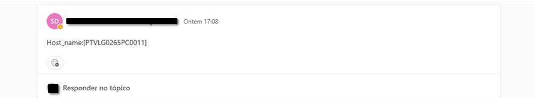

- Com base neste identificador, o fluxo de automação localiza a máquina no CrowdStrike e disponibiliza informação via email:

  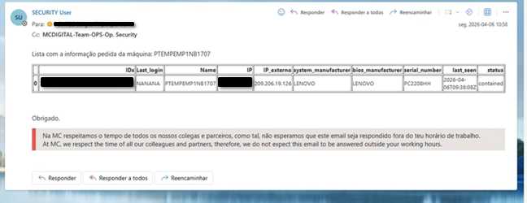

Com a informação obtida, maquina em estado “contained”, o utilizador coloca no chat da automação pedido com Host:xx -\> Remover containment

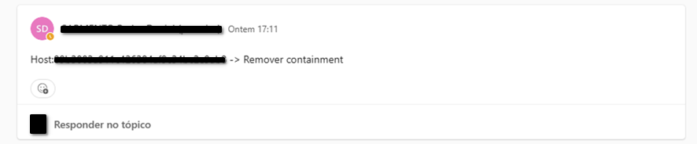

Quando a automação não consegue remover bloqueio da maquina, o utilizador recebe email da automação (Security User) a informar:

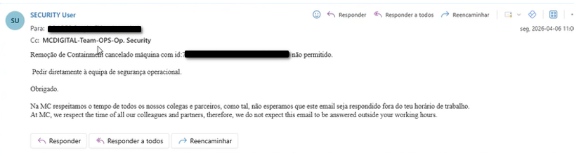

O utilizador deve então executar o pedido no chat “Maquinas Barradas” para iniciar o processo desbloqueio descrito.

## 2. Identificação da máquina no CrowdStrike

Depois de receber o pedido de desbloqueio, o primeiro passo é deixar “like” na mensagem do pedido, para sinalizar que está com o pedido, seguindamente localizar corretamente a máquina no CrowdStrike e confirmar que se trata efetivamente do host reportado pelo utilizador.

### 2.1 Pesquisa de host

1.  Aceder ao portal CrowdStrike \> Menu \> Host setup and management \> Host Management

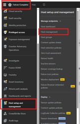

1.  Ir à área de pesquisa de hosts e procurar pelo hostname indicado pelo utilizador (ou outro identificador aplicável).

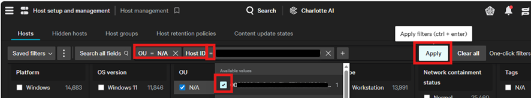

1.  Selecionar o host correspondente para abrir o detalhe da máquina.

No detalhe do host será possível visualizar, entre outros, os campos “Host status”, “Network containment status” e “TAGS”, fundamentais para a análise.

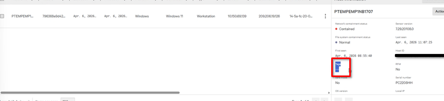

## 3. Verificação do estado de contenção de rede

Não efetuar “Lift Network Containment” sem antes validar o “Host status”, as “TAGS” e o “Activity Log” da máquina. Ignorar estas verificações pode conduzir ao desbloqueio de máquinas ainda comprometidas.

O campo “Network containment status” indica se a máquina está ou não barrada a nível de rede.

### 3.1 Campo "Network containment status"

Verificar o valor do campo “Network containment status” na ficha do host:

- Se o valor for “CONTAINED”, a máquina encontra-se barrada a nível de rede.

- Se surgir outro estado (por exemplo, não contém a indicação de “CONTAINED”), não se trata de uma máquina atualmente em contenção de rede e o problema poderá ser de outra natureza.

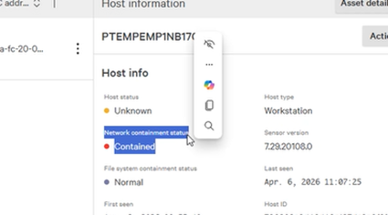

Este campo é o principal indicador que justifica o pedido de desbloqueio. Apenas deve ser alterado (via “Lift Network Containment”) depois de concluídas todas as validações descritas nas secções seguintes.

## 4. Análise do "Host status" e "TAGS"

Antes de desbloquear a máquina, é essencial interpretar corretamente o “Host status” e as “TAGS” associadas. Estes campos indicam o estado de saúde do host e se existem classificações específicas, como infeção ou fase de descontinuação.

### 4.1 Campo "Host status"

O “Host status” permite identificar se o agente CrowdStrike na máquina está ativo, desligado, ou num estado que possa justificar problemas de comunicação. Em contexto de máquinas barradas, deve ser verificado para garantir que, após o desbloqueio, o host continuará a reportar corretamente para a consola.

### 4.2 Campo "TAGS"

As “TAGS” são usadas para classificar hosts segundo critérios específicos (por exemplo, estado de infeção ou fase do ciclo de vida da máquina).

Sempre que o campo “TAGS” não esteja vazio, é obrigatório analisar cuidadosamente todas as tags atribuídas antes de considerar o desbloqueio da máquina.

Em particular, devem ser procuradas as seguintes tags críticas:

- **Tag** `Infected`**: indica que a máquina foi classificada como infetada. O desbloqueio não deve ser efetuado sem validação adicional da equipa de segurança.**

- **Tag** `FalconGroupingTags/PhaseOut`**: indica que a máquina está em processo de descontinuação ou retirada de serviço. Nestes casos, o desbloqueio deve ser ponderado em função do plano de fase-out.**

Se a máquina tiver a tag “Infected”, deve ser escalada para a equipa de segurança antes de qualquer “Lift Network Containment”. Se tiver a tag “FalconGroupingTags/PhaseOut”, confirmar se o desbloqueio é mesmo necessário, dado o eventual desligamento definitivo do host.

## 5. Consulta do "Activity Log"

O “Activity Log” é o registo das ações relativas ao host, incluindo o momento em que foi colocada em contenção de rede, os motivos associados e quaisquer alterações posteriores. A análise deste histórico é essencial para compreender o contexto do bloqueio.

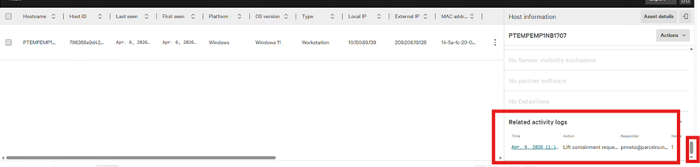

### 5.1 Aceder ao "Activity Log"

1.  Na ficha do host no CrowdStrike, localizar a secção de “Activity Log”.

2.  Rever os eventos associados ao início da contenção de rede, procurando referências a incidentes, deteções ou ações manuais anteriores.

Este histórico ajudará a determinar se a contenção foi desencadeada por deteções de malware, políticas automáticas, ou intervenções de um operador, e se houve ações posteriores de limpeza ou mitigação.

## 6. Execução de "Lift Network Containment"

Após realizadas todas as verificações anteriores — “Network containment status”, “Host status”, “TAGS” e “Activity Log” — e confirmando que não há risco de segurança ativo ou políticas que impeçam o desbloqueio, pode ser considerada a ação de “Lift Network Containment”.

### 6.1 Condições para desbloqueio

- Não existirem tags críticas como “**Infected”** (sem validação explícita da equipa de segurança).

- A máquina não estar em fase de descontinuação (**“FalconGroupingTags/PhaseOut”**) ou, se estiver, haver justificação clara para o desbloqueio temporário.

- O “Activity Log” não evidenciar incidentes recentes sem remediação.

### 6.2 Passos para "Lift Network Containment"

1.  Seleccionar a “Actions” \> “Lift Network Containment” sobre a máquina.

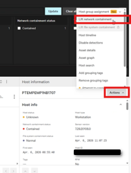

1.  Adicionar comentário com dados para auditoria, quem pediu, hora, data, id máquina, conforme exemplo:

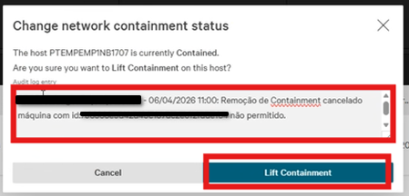

Após executar o “Lift Network Containment”, o estado deixará de ser “CONTAINED” e poderá passar para um estado intermédio de “pending” até a alteração ser totalmente aplicada.

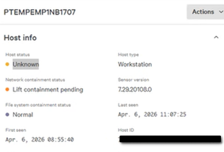

## 7. Interpretação de estados e automações

Alguns estados e automações no CrowdStrike podem influenciar o comportamento do host após o desbloqueio ou mesmo determinar uma nova contenção automática ao fim de determinado período.

### 7.1 Estado "pending"

Após a ação de “Lift Network Containment”, é possível que o estado de aplicação da alteração apareça como “Lift containment pending”. Este estado indica que a ação foi registada, mas ainda não concluída no agente da máquina. Deve ser dada margem de tempo para a propagação antes de considerar o procedimento concluído.

### 7.2 Automações de 20 e 40 dias

Existem automações configuradas que, ao fim de certos períodos (por exemplo, após 20 dias ou 40 dias), podem alterar o estado de máquinas que não comunicam ou que se encontram em determinadas condições. Estas automações podem voltar a colocar máquinas em contenção ou ajustar o seu estado de forma automática.

Ao analisar o “Activity Log”, devem ser tidos em conta estes eventos automáticos, de modo a perceber se a contenção atual resulta de uma ação automática de tempo (20/40 dias) ou de um incidente de segurança específico.

## 8. Comunicação ao utilizador

Sempre que for aberto um pedido no chat “Maquinas Barradas”, é importante manter o utilizador informado sobre o estado da análise e as ações executadas. Normalmente colocamos um visto na mensagem, o utilizador saber que está a ser tratado.

### 8.1 Após análise ou ação

A comunicação deve ser clara e objetiva, evitando detalhes técnicos desnecessários, mas garantindo que o utilizador compreende se a máquina foi desbloqueada e estado atual dela (Online, Offline ou Unknow considera se por padrão Offline).

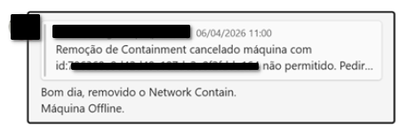

## 10. Recomendação

Recomenda-se que todas as intervenções de desbloqueio de máquinas barradas sigam estritamente os passos descritos neste guia, garantindo que não é efetuado qualquer “Lift Network Containment” sem validação prévia adequada. O registo detalhado das ações e decisões, acompanhado de um comentário estruturado como o exemplo indicado, facilita auditorias, investigações de incidentes e a melhoria contínua dos processos de segurança.

