# Runbook prático Phishing - Draft

Este runbook tem como objetivo apresentar, de forma simples, gráfica e prática, os principais passos e considerações de tratamento de casos de spam/phishing, bem como o uso de algumas ferramentas utilizadas pelo SOC.  
Serve como guia rápido para análise, classificação e resposta a reports de phishing, ajudando a garantir consistência no tratamento de incidentes.

------------------------------------------------------------------------

## Indice

1.  [Pré-requisitos](#1-pré-requisitos)

2.  [Configuração de filtros para visualização de casos](#2-definir-filtros-adequados-para-visualização-de-casos-spamphishing)

3.  [Validação inicial do report e do remetente](#3-confirmar-origem-report-by-e-dados-do-report)

4.  [Validação técnica (SPF, DKIM, DMARC e headers)](#4-validar-spf-dkim-e-dmarc)

5.  [Motores de reputação e sinais de engenharia social](#5-verificar-sinalização-por-motores-de-reputação-e-engenharia-social)

6.  [Identificação de URLs e anexos maliciosos](#6-identificar-resumo-de-urls-ou-anexos-maliciosos)

7.  [Consulta de ficheiro .eml e anexos no CaseWall](#7-consulta-de-ficheiro-eml-e-anexos-no-casewall)

8.  [Verificação de histórico de entidades (Entities Highlights)](#8-verificação-de-histórico-de-entidades-entities-highlights)

9.  [Adicionar evidências em Entities Highlights (Manual Action)](#9-adicionar-evidências-em-entities-highlights-manual-action)

10. [Verificação de links com VirusTotal e sandbox](#10-verificação-de-links-com-virustotal-e-sandbox)

11. [Respostas aos casos e fecho (visão geral)](#11-respostas-aos-casos-e-fecho-visão-geral)

12. [Fecho manual de casos](#12-fecho-manual-de-casos)

13. [Casos de phishing falso positivo – Unsubscribe](#13-casos-de-phishing-falso-positivo--unsubscribe)

14. [Casos de spam entre emails internos](#14-casos-de-spam-entre-emails-internos)

15. [Casos de domínios parecidos/“ghosts” (possível impersonificação)](#15-casos-de-domínios-parecidosghosts-possível-impersonificação)

16. [Bloqueio de sender/email no Microsoft Defender](#16-bloqueio-de-senderemail-no-microsoft-defender)

17. [Remoção de emails das caixas de correio](#17-remoção-de-emails-das-caixas-de-correio)

18. [Libertar emails em quarentena](#18-libertar-emails-em-quarentena)

19. [Verificar contas bloqueadas](#19-verificar-contas-bloqueadas)

20. [Uso de hash de emails em Threat Hunting](#20-usar-hash-de-emails-em-threat-hunting)

21. [Bloqueio IOCs](#21-bloqueio-iocs)

22. [Considerações finais e formação recomendada](#22-considerações-finais)

------------------------------------------------------------------------

## 1. Pré-requisitos

Deve garantir os seguintes pré‑requisitos em coordenação com manual de onboarding:

1.  Função/perfil: Analista SOC SIEM/SOAR Google SecOps

2.  Permissões/roles no Microsoft Defender (consoante tarefas):

    - Security Administrator

3.  Capacidade de visualizar e exportar headers de mensagens.

4.  Conectividade e credenciais válidas para todas as ferramentas referidas.

5.  Ferramentas necessárias:

    - VirusTotal (private scanning), sandbox/appliances de análise dinâmica quando aplicável.

    - Office 365 Safelinks Link Decoder, remover track de safelinks.

    - Cyberchef (versão offline), para decoding manual, visualização headers, conteúdos de email.

## 2. Definir filtros adequados para visualização de casos spam/phishing

Este runbook aborda, de forma simplificada e gráfica, a configuração e uso de filtros para visualizar casos de spam/phishing na ferramenta do SOC.

> 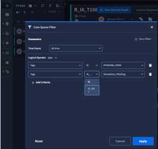

------------------------------------------------------------------------

## 3. Confirmar origem (Report by) e dados do report

1.  Confirmar origem do report (“Report by”), incluindo:

    - Nome

    - Funções / cargo

    - Contexto do utilizador

      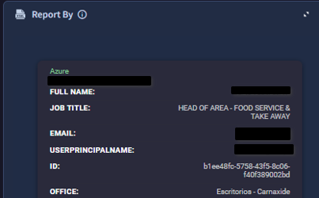

2.  Avaliar a legitimidade dos conteúdos do email ou a possibilidade de técnicas engenharia social com vista de spearphishing. Email View ou via visualização .eml do outlook.

3.  Validar:

    - Remetente

    - Display name

    - Domínio do sender email

> \[INSERIR IMAGEM DA VISTA DO REPORT / REMETENTE\]

------------------------------------------------------------------------

## 4. Validar SPF, DKIM e DMARC

Validar os registos e autenticações feitas do lado dos servidores do Microsoft 365.

Analisar os headers, nomeadamente:

- `Received-By`

- Resultados de SPF, DKIM, DMARC, eventuais falhas de autenticação em saltos devem ser validadas.

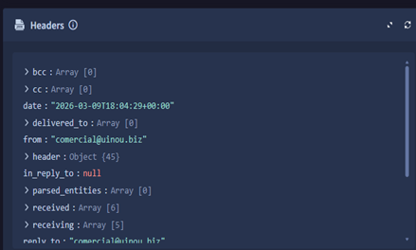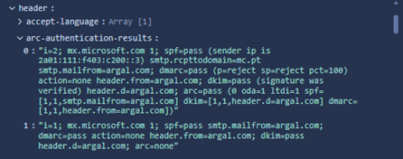

## 5. Verificar sinalização por motores de reputação e engenharia social

1.  Verificar se o email foi sinalizado por motores de reputação.

2.  Validar o campo **Subject** para possíveis indicadores de engenharia social, como:

    - Urgência (“urgent”, “ação imediata”, etc.)

    - Ofertas, promoções suspeitas

    - Mensagens de pressão, medo, ameaça

3.  Verificar também:

    - `reply_to`

    - `return_path`

> 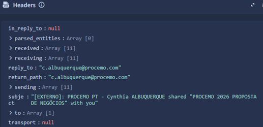

------------------------------------------------------------------------

## 6. Identificar resumo de URLs ou anexos maliciosos

Identificar e rever o resumo de:

- URLs presentes no email

- Anexos, com destaque para possíveis ficheiros maliciosos

> 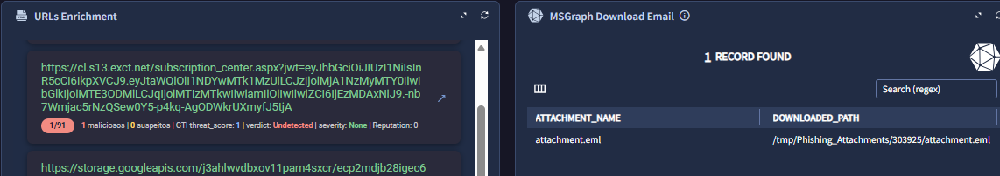
>
> (colocar imagem de um caso com anexo malicioso identificado)

------------------------------------------------------------------------

## 7. Consulta de ficheiro .eml e anexos no CaseWall

O ficheiro `.eml` e os restantes documentos anexados ao email original podem ser recolhidos e visualizados em:

- **CaseWall \> Comments**

> 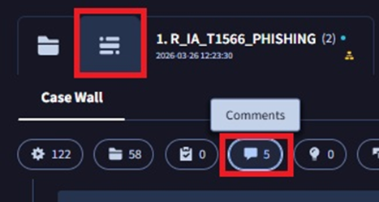

------------------------------------------------------------------------

## 8. Verificação de histórico de entidades (Entities Highlights)

Verificar o histórico de entidades associadas ao caso em **Entities Highlights**, para perceber:

- Recorrência do remetente ou domínio do sender de forma a tentar identificar historico de incidentes similares associados e outras relações relevantes.

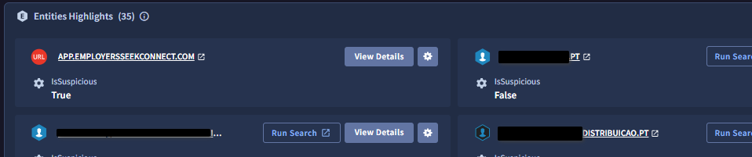

------------------------------------------------------------------------

## 9. Adicionar evidências em Entities Highlights (Manual Action)

Adicionar evidências de comprometimento que suportem o casos:

1.  Em **Entities Highlights**, selecionar **Manual Action**.

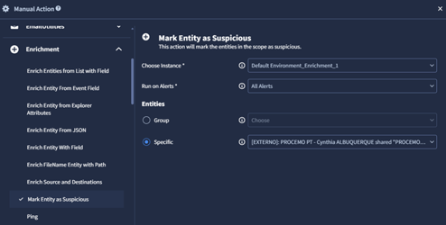

1.  Inserir:

    - Domínios suspeitos

    - Remetentes

    - URLs

    - Hashes de ficheiros

> \[INSERIR IMAGEM DA AÇÃO MANUAL / ENTITIES HIGHLIGHTS\]

------------------------------------------------------------------------

## 10. Verificação de links com VirusTotal e sandbox

Link relevante: [Google TI - Private Scanning](https://www.virustotal.com/gui/private-scanning)

Para verificação de links maliciosos:

1.  Submeter URLs para análise em:

    - **VirusTotal** (private scanning) rever analise e se tem indicadores

    - Se necessário usar Sandbox interactiva pelo GTI, configurar da seguinte forma exemplo (URL):

      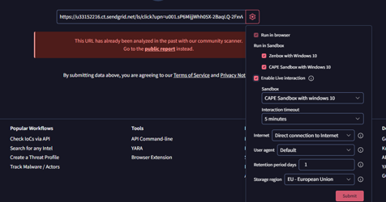

2.  Avaliar resultados da analise e eventualmente extrair evidências:

    - Reputação do domínio

    - Comportamento detetado em sandbox

    - Associações a malware conhecido

> \[INSERIR IMAGEM DE SUBMISSÃO / RESULTADOS VT / SANDBOX\]

------------------------------------------------------------------------

## 11. Respostas aos casos e fecho (visão geral)

A resposta pode ser automatizada ou manual, nos proximos pontos vamos verificar alguns casos mais comuns/incomuns.  
As templates de email devem ser reconhecidas incialmente, podem ser consultadas e visualizadas em Settings \> Soar Settings \> Environments \> Emails HTML Templates.

## 12. Fecho manual de casos

Quando há necessidade de enviar template personalizado de resposta ao remetente, é necessário **fechar o caso manualmente**. O seguinte caso é valido em todos casos de uso que não usem a automação

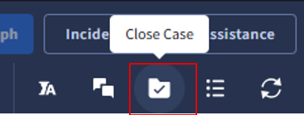

1.  Fechar o caso manualmente, justificando:

    - Classificação como Maliciso ou não

    - Ação tomada (true positive/false positive phishing/spam, etc,etc)

      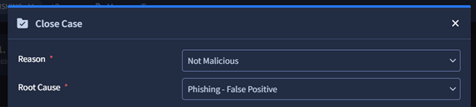

## 13. Casos de phishing falso positivo – Unsubscribe

Fluxo típico para casos de phishing classificados como falso positivo (ex.: newsletters legítimas, comunicações de marketing etc.)

1.  \[Responder\]

    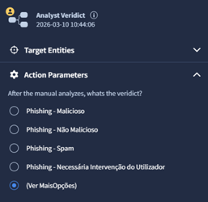

2.  \[PASSO 2 - Templates Modo manual\]

    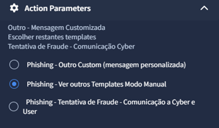

3.  Verificar e se selecionar instância correta.

    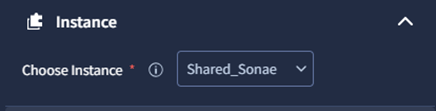

4.  Selecionar **“attachments Paths”** e adicionar o ficheiro de email (.eml).

    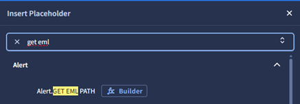

5.  Verificar o conteúdo e selecionar o template de email:

    - **“Phishing – Não Malicioso – Unsubscribe”**

- 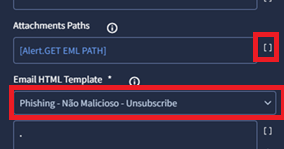

------------------------------------------------------------------------

## 14. Casos de spam entre emails internos

Quando o report envolve emails **entre contas internas**:

1.  Responder ao report confirmando que se trata de email interno.

2.  O resultado esperado é um **fecho automático do caso**, de acordo com a configuração da ferramenta.

> 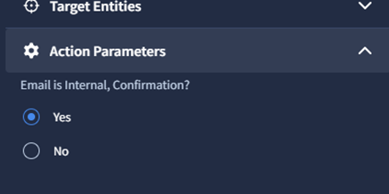

------------------------------------------------------------------------

## 15. Casos de domínios parecidos/“ghosts” (possível impersonificação)

Para domínios semelhantes (lookalike) ou “ghosts”, com potencial de impersonificação:

1.  Recomenda-se **escalar para a equipa de Cyber_GODS**, através da caixa:

    - `email_soc_nivel_god@emp.pt`

2.  Dar feedback ao report com template manual, personalizando a mensagem, por exemplo:

    - “A equipa de SOC tomou conhecimento e está a analisar a situação. Obrigado.”

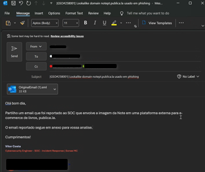

1.  Aguardar resolução por parte de Cyber.

2.  Dar novo feedback ao report após a resolução.

------------------------------------------------------------------------

## 16. Bloqueio de sender/email no Microsoft Defender

Quando há bloqueio de email no **Microsoft Defender**:

1.  Verificar a política ou regra que originou o bloqueio.

2.  Rever detalhes do incidente em Defender.

3.  **Selecionar** **entidades a bloquear** quando apropriado:

    - Domínios

    - Endereços de email

    - IPs

    - URLs

    - Anexos

> 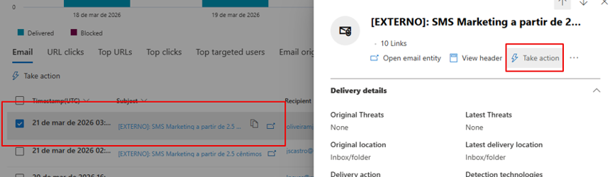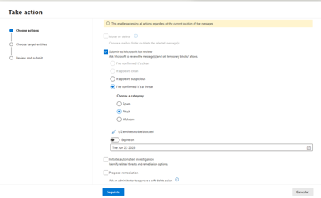
>
> O período de bloqueio é mediante a sua tipologia, consultar os períodos nas politicas para cada caso. pode variar de 7dias a 1 mês, 3 meses.
>
> 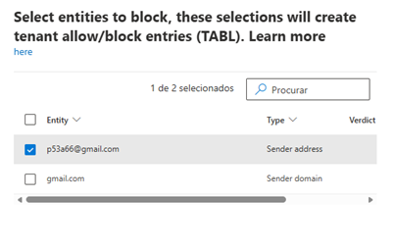

1.  Identificar a tipologia do report, Spam/Phishing/Malware e associar o **ID do caso no GSO**.

> 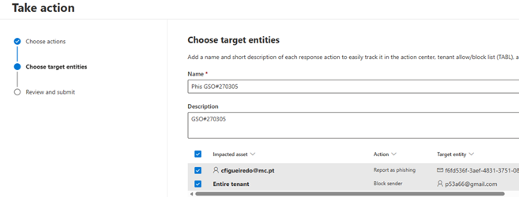

------------------------------------------------------------------------

## 17. Remoção de emails das caixas de correio

Caso seja necessário remover emails das caixas de correio:

1.  Confirmar com o tutor / responsável.

2.  Garantir que possui **permissões adequadas** para executar a eliminação.

3.  Utilizar as ferramentas indicadas para:

    - Localizar emails

    - Apagar das caixas afetadas

> \[INSERIR IMAGEM DO PROCESSO DE REMOÇÃO / SEARCH & PURGE\]

------------------------------------------------------------------------

## 18. Libertar emails em quarentena

Nos casos em que seja necessário libertar emails em quarentena:

1.  Validar cuidadosamente a legitimidade do email.

2.  Confirmar:

    - Remetente e domínio

    - Conteúdo

    - URLs e anexos

3.  Proceder à **libertação a partir da quarentena** apenas se o email for considerado seguro.

> 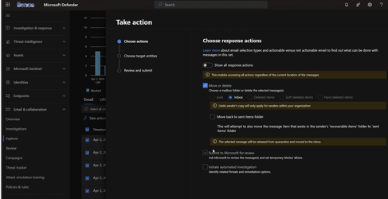

------------------------------------------------------------------------

## 19. Verificar contas bloqueadas

Verificar, nas ferramentas de administração, as **contas de email bloqueadas**, para entender se:

- O bloqueio é justificado

- Há impacto operacional no utilizador

- É necessária revisão de políticas

> 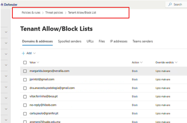

------------------------------------------------------------------------

## 20. Usar hash de emails em Threat Hunting

Para análises avançadas em **Threat Hunting**:

1.  Extrair o **hash** dos emails (ou anexos).

2.  Utilizar o hash em ferramentas de hunting/siem/defender para:

    - Identificar propagação

    - Encontrar ocorrências noutras caixas ou sistemas

    - Correlacionar com outros incidentes

> Exemplo forma rapida de retirar hash de um ficheiro na maquina local:
>
> 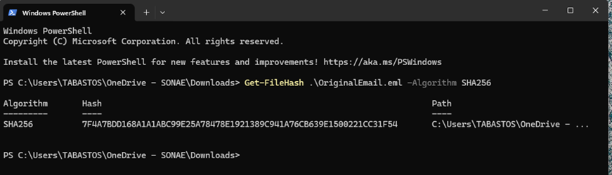

------------------------------------------------------------------------

## 21. Bloqueio IOCs

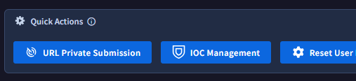

IOCs management abre um playbook paralelo para responder. Segue um exemplo prático para bloqueio de um domínio, em todas fases.

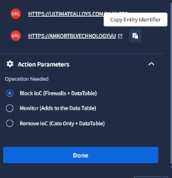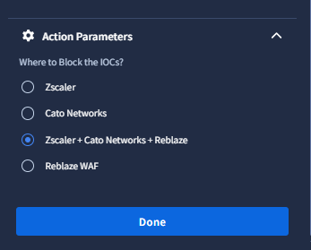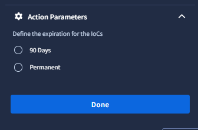

Dominios extremamente abusados ou com tentativa de engano domínios legítimos, habitualmente deveram ficar em permanente, restantes 90dias.  

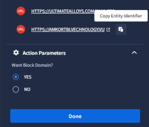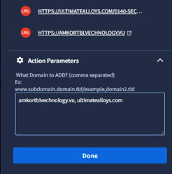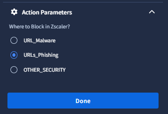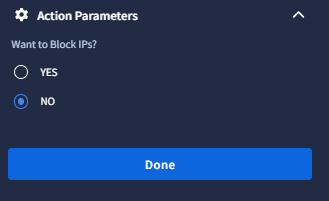

------------------------------------------------------------------------

## 22. Considerações finais

Este runbook serve como guia prático para o tratamento de incidentes de spam/phishing e uso de ferramentas de suporte (Defender, VirusTotal, sandbox, etc.).  
É importante manter o conhecimento atualizado e seguir sempre as políticas internas de segurança e escalamento.

### Formação recomendada

- How to investigate email messages in Microsoft Defender for Office 365  
  <https://www.youtube.com/watch?v=5hA7VfaMvqs>

- Microsoft Defender for Office 365 \| Mail Bombing and Mixed-Mode Attack Protection  
  <https://www.youtube.com/watch?v=rXGsQpqCWD4>

- Playlist Microsoft Defender for Office 365  
  <https://www.youtube.com/playlist?list=PL3ZTgFEc7LystRja2GnDeUFqk44k7-KXf>

- Proteção contra email bombs com Microsoft Defender for Office 365  
  <https://techcommunity.microsoft.com/blog/microsoftdefenderforoffice365blog/protection-against-email-bombs-with-microsoft-defender-for-office-365/4418048>

